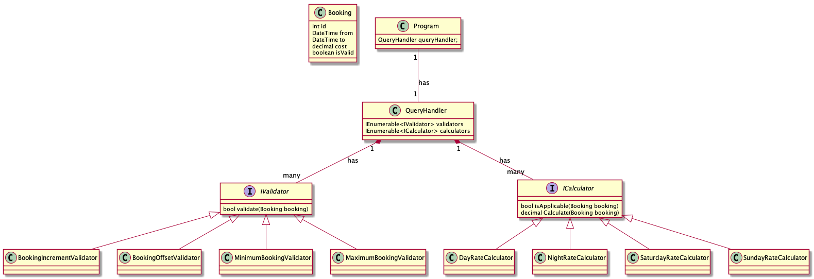
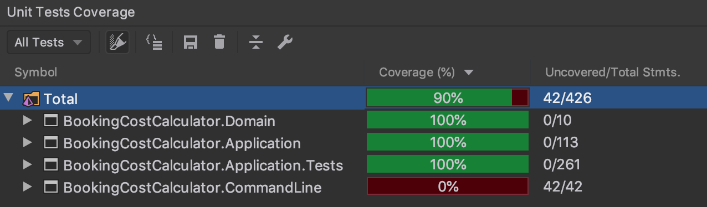

Booking Cost Calculator
============

Requirements
------------

* .Net Core 3.1 is installed on your machine
* An IDE such as Visual Studio .Net or Jetbrains Rider is installed on your machine

Assumptions
------------

* The specification mentions that the Day rate is applicable between 600 and 2000. It also mentions that night rate is applicable between 2000 and 600. In order to avoid conflicts due to the overlap, it is assumed that actual start and end times for Day and Night rates should be 601 to 2000 and 2001 to 600 respectively.
* The specification did not mention it but it is assumed that Saturday and Sunday rates should be applied if any part of the booking falls on any one of them.

Overview
------------

This repository contains the Booking Cost Calculator application. The application is implemented as a .Net Core 3.1 console application. It bootstraps the application using the .Net Core IOC mechanism.

The source code is available in Bitbucket and can be accessed via the following url:

* https://github.com/jakestateresa/bookingcostcalculator

It uses Mediatr to facilitate CQRS. The Console Application sends a query to the query handler residing in the application layer. This can further expanded to allow the application to send/receive other messages in the form of commands and queries.

It is structured using Clean Architecture. A very thin domain layer containing just the Booking class is shared to other modules in the application. The application layer contains logic for booking validations and performing computations.

Below is a diagram documenting the structure of the application.



### Validators

Validators represent rules such as minimum/maximum booking rule, as well as rules ensuring that the booking is in 15 minute increments and does not start before it ends are implemented in using validators. The following validators are available:

* MinimumBookingValidator - Ensures that a booking is at least one hour long
* MaximumBookingValidator - Ensures that a booking is at most 24 hours long
* BookingOffsetValidator - Ensures that a booking starts and ends in the same timezone offset
* BookingIncrementValidator - Enssures that a booking can be done in 15 minute increments

### Calculators

Calculators encapsulate logic for computing the cost of a booking ensuring the correct rate is applied. The following calculators are available:

* DayRateCalculator - Ensures that the day rate configured in the app settings file is applied to bookings between 6:00am and 8:00pm.
* NightRateCalculator - Ensures that the night rate configured in the app settings file is applied to bookings between 8:00pm and 6:00am.
* SaturdayRateCalculator - Ensures that the saturday rate configured in the app settings file is applied to bookings that fall on a Saturday.
* SundayRateCalculator - Ensures that the saturday rate configured in the app settings file is applied to bookings that fall on a Sunday.

Test Coverage
------------

The application has 90% code coverage. 100% code coverage on the Application and Domain layers. Below is a screenshot of the code coverage panel in Jetbrains Rider.



XUnit tests are available to assert the following:

Namespace|Class|Test|Passed
---|---|---|---
Calculation|DayRateCalculatorTests|Before6amTests|Passed
Calculation|DayRateCalculatorTests|BeforeMidnightTests|Passed
Calculation|DayRateCalculatorTests|FromBoundaryTests|Passed
Calculation|DayRateCalculatorTests|SuccessTests|Passed
Calculation|DayRateCalculatorTests|ToBoundaryTests|Passed
Calculation|NightRateCalculatorTests|DayTimeTests|Passed
Calculation|NightRateCalculatorTests|FromBoundaryTests|Passed
Calculation|NightRateCalculatorTests|SuccessTests|Passed
Calculation|NightRateCalculatorTests|ToBoundaryTests|Passed
Calculation|SaturdayRateCalculatorTests|FridayOverlapTests|Passed
Calculation|SaturdayRateCalculatorTests|FromBoundaryTests|Passed
Calculation|SaturdayRateCalculatorTests|NonSaturdayTests|Passed
Calculation|SaturdayRateCalculatorTests|SuccessTests|Passed
Calculation|SaturdayRateCalculatorTests|SundayOverlapTests|Passed
Calculation|SaturdayRateCalculatorTests|ToBoundaryTests|Passed
Calculation|SundayRateCalculatorTests|FromBoundaryTests|Passed
Calculation|SundayRateCalculatorTests|MondayOverlapTests|Passed
Calculation|SundayRateCalculatorTests|NonSundayTests|Passed
Calculation|SundayRateCalculatorTests|SaturdayOverlapTests|Passed
Calculation|SundayRateCalculatorTests|SuccessTests|Passed
Calculation|SundayRateCalculatorTests|ToBoundaryTests|Passed
Queries|GetBookingCostsQueryTests|CalculationDoesNotKickInWhenThereAreNoApplicableCalculators|Passed
Queries|GetBookingCostsQueryTests|CalculationIsDoneUsingTheFirstApplicableCalculator|Passed
Queries|GetBookingCostsQueryTests|ValidationFailsWhenOneValidatorFails|Passed
Queries|GetBookingCostsQueryTests|ValidationSucceedsWhenAllValidatorsPass|Passed
Validation|BookingIncrementValidatorTests|ErrorTests|Passed
Validation|BookingIncrementValidatorTests|SuccessTests|Passed
Validation|BookingOffsetValidatorTests|ErrorTests|Passed
Validation|BookingOffsetValidatorTests|SuccessTests|Passed
Validation|MaximumBookingValidatorTests|ErrorTests|Passed
Validation|MaximumBookingValidatorTests|SuccessTests|Passed
Validation|MinimumBookingValidatorTests|ErrorTests|Passed
Validation|MinimumBookingValidatorTests|SuccessTests|Passed

Running the Environment
------------

In order to run the application, please execute following command on the terminal:

```console
cd ./BookingCostCalculator/BookingCostCalculator.CommandLine
dotnet run
```

The output.json file will be stored in the following folder:

 * BookingCostCalculator/BookingCostCalculator.CommandLine/bin/Debug/netcoreapp3.1/